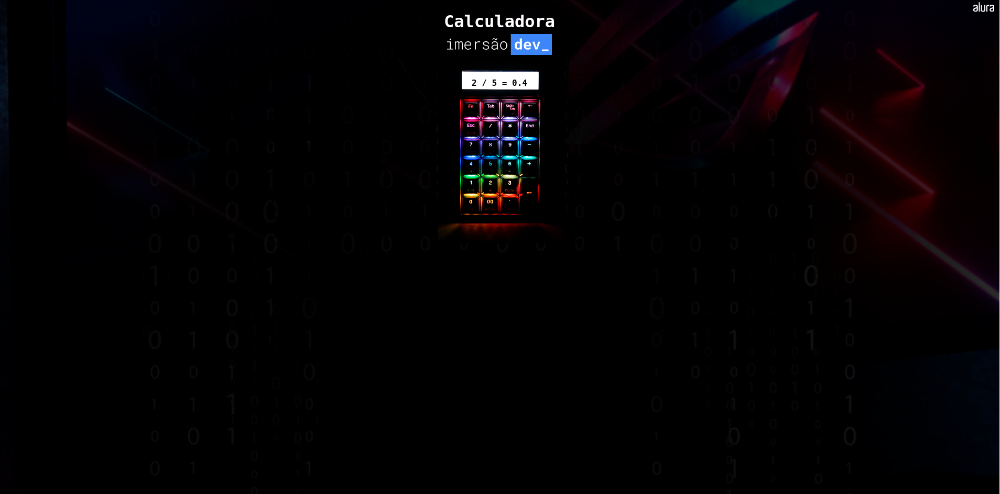
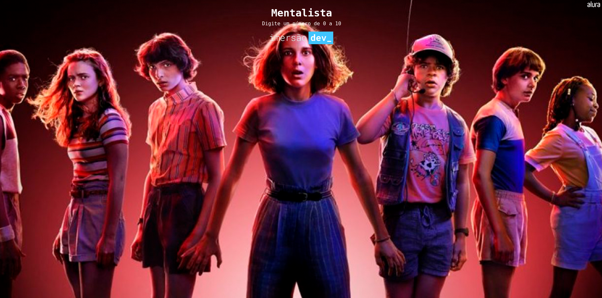
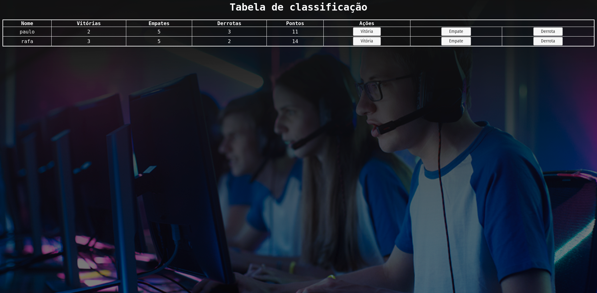
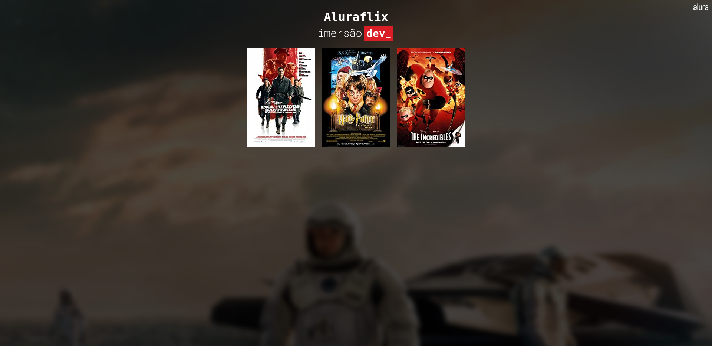
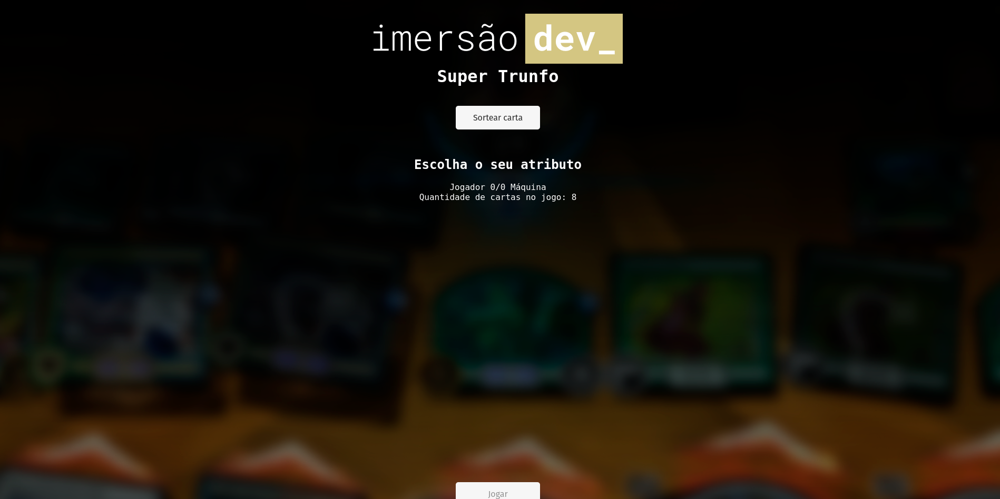
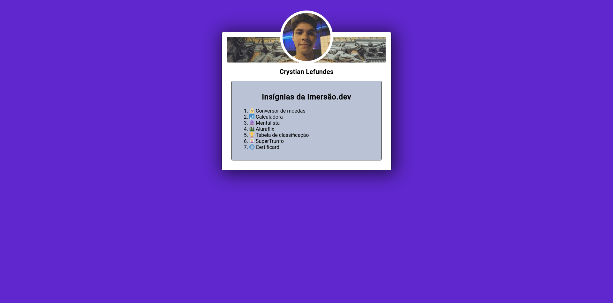

<h1 align="center">
    
</h1>

  <a href="#technologies">Technologies</a>&nbsp;&nbsp;&nbsp;|&nbsp;&nbsp;&nbsp;
  <a href="#About">About</a>&nbsp;&nbsp;&nbsp;|&nbsp;&nbsp;&nbsp;
  <a href="#preview">Preview</a>&nbsp;&nbsp;&nbsp;|&nbsp;&nbsp;&nbsp;
  <a href="#license">License</a>

 
 

# 🤖 Technologies

   
  
I used codepen as it is a recommendation from Alura, an online text editor where we can use HTML, CSS and JavaScript.

# 💻 About
  
This immersion was focused on JavaScript, in other words, the HTML and CSS codes were not made by me, but by Alura people. The subjects covered were if / else, arrays, JavaScript's direct link to HTML, functions, this immersion was based on teaching the fundamentals of JavaScript using the online text editor Codepen so that everyone has access to the language without the barrier of having to install anything before.

# 🖼️ Preview

To see the sites created, follow the links below: 

<a href="https://conversordemoedasalura.netlify.app/">Conversor de moedas:</a>  
  
<a href="https://calculadoralura.netlify.app/">Calculadora:</a>  
  
<a href="https://omentalistalura.netlify.app/">Mentalista:</a> 
  
<a href="https://tabelaclassificacaoalura.netlify.app">Tabela de classificação:</a>  
  
<a href="https://aluraflix1.netlify.app">Final version of AluraFlix*:</a>  
  
<a href="https://supertrunfo3.netlify.app">Final version of Super Trunfo*:</a>  
  
<a href="https://meucertificard.netlify.app">Certificard:</a>  
  

** These sites have more versions because in some lessons they were used to teach different concepts.  
* Versions of AluraFlix:  
<a href="https://aluraflix1.netlify.app">AluraFlix 1</a>  
<a href="https://aluraflix2.netlify.app">AluraFlix 2</a> 

* Versions of Super Trunfo:  
<a href="https://supertrunfo1.netlify.app">Super Trunfo 1</a>  
<a href="https://supertrunfo2.netlify.app">Super Trunfo 2</a>  
<a href="https://supertrunfo3.netlify.app">Super Trunfo 3</a>  

# 📝 License

This project is licensed under the MIT License. See the [LICENSE]() file for details.

---

Made by [Crystian](https://www.linkedin.com/in/crystian-lefundes/) 💚 !